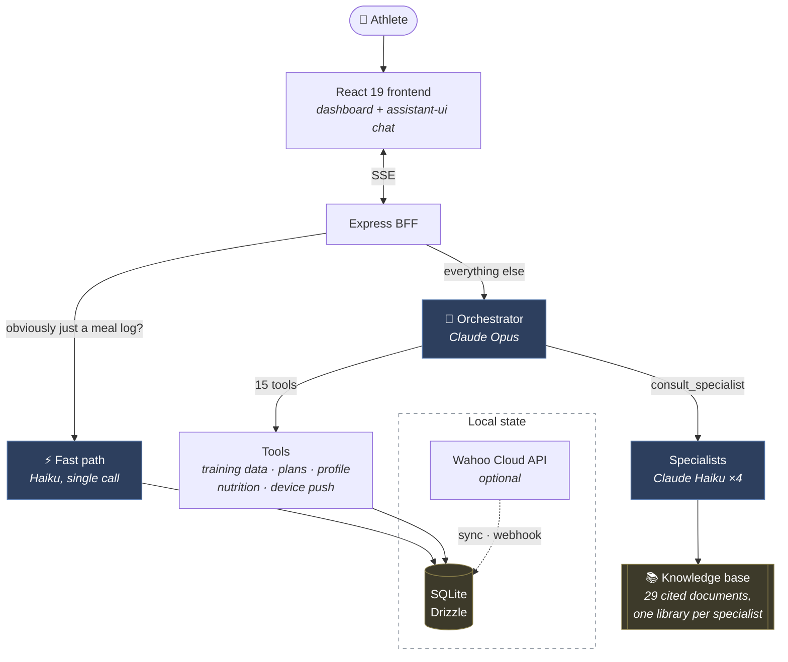

# Rumble

**An AI cycling coach that runs entirely on your own machine.** One conversation, backed by an orchestrator that delegates to a team of isolated domain specialists — a cycling coach, a nutritionist, a strength & conditioning coach, and a recovery specialist — each with its own narrow system prompt and its own cited, research-grounded knowledge base.

Bring your own [Anthropic API key](https://console.anthropic.com). No server to run beyond your own laptop, no account, no hosted service, no vector database.

## Demo

|                                    |                                    |                                    |
| :--------------------------------: | :--------------------------------: | :--------------------------------: |
|         |         |         |

---

## Why this is interesting

The chat UI isn't the hard part. The orchestration is.

A single prompt stuffed with four coaching personas and every reference document produces a model that sounds like a committee and grounds itself in whatever happens to be nearest in context. Rumble splits the job in two:

- **One orchestrator** (`claude-opus-4-8`) owns the conversation and the athlete's data. It decides what a question actually needs — a database lookup, a plan revision, real domain expertise, or just an answer.
- **Four specialists** (`claude-haiku-4-5`), each consulted in isolation. A specialist's context contains *only* its own persona and its own document library. It never sees the other three, and never sees the conversation.

That buys two things. Each specialist's voice and grounding stay intact as the knowledge base grows, and expensive reasoning goes only where judgment is actually required — tool routing — while narrow, grounded Q&A runs on a model that costs a fifth as much and answers faster.



### What a real question looks like


---

## Three decisions worth defending

### 1. No vector database

The obvious design is RAG: chunk the documents, embed them, retrieve the top-k per question. Rumble did exactly that, and then deleted it.

The measurement that killed it: **the largest specialist library is ~14,000 tokens — about 7% of Haiku's context window.** Sending the whole thing in a prompt-cached prefix costs roughly $0.0014 per consult on a cache hit, which is about what four retrieved chunks cost uncached. Retrieval was buying nothing, and charging for it:

| | Retrieval (before) | Whole library (now) |
| --- | --- | --- |
| Can miss relevant content | Yes — no relevance floor, fixed `k` | No |
| Moving parts | Embedder, vector search, `kb_chunks` table, re-embed step | Read files at startup |
| Cost per consult | ~$0.0015 | ~$0.0014 cached · ~$0.014 cold |
| Editing a document | Edit → re-run the embed pipeline | Edit → restart |

Deleting it removed two modules, a build step, a database table, and a 48-package dependency. The knowledge base is still split per specialist — that isolation is the point — but within a specialist there's nothing to tune, miss, or keep in sync.

**This stops being true at roughly 3× the current size.** At 40k+ tokens per vertical, cold-cache cost and prefill latency start to matter, and the right answer becomes letting the specialist request sections from a table of contents — not reintroducing embeddings.

### 2. Prompt caching

The orchestrator's system prompt and all 15 tool schemas are static, so they're marked cache-eligible and sit ahead of the per-turn context. Specialists do the same with persona + library.

Caching is a **prefix match**: one changed byte invalidates everything after it. The fix is ordering — freeze the prefix, and put anything that varies after the last cache breakpoint.

The specialist prefixes are sorted deterministically for the same reason — `readdir` order isn't guaranteed, and a library that concatenates differently between restarts would never cache.

### 3. The auth seam

There's no real auth (single local athlete, no accounts), but every route resolves its athlete through one function — `resolveAthleteId` in `apps/bff/src/middleware/auth.ts`. Adding real auth means rewriting that one function body to verify a session or JWT instead of falling back to the seeded athlete. No controller changes.

Every database query across every tool and controller is scoped by `athleteId`. That was audited by hand, and the audit found two real cross-tenant bugs — both now have regression coverage in `chat.controller.test.ts` and `log-session-feedback.test.ts`, using a harness that simulates two athletes without needing multi-user auth to exist yet.

---

## The knowledge base

29 markdown documents across four verticals, each grounded in named, checkable sources — consensus statements, position stands, and meta-analyses rather than coaching blogs.

| Specialist | Docs | Prefix | Representative sources |
| --- | :-: | :-: | --- |
| **Cycling coach** | 9 | ~14.0k tok | Coggan power zones · Seiler polarized training · Poole critical power · Buchheit & Laursen HIIT · Bosquet tapering meta-analysis |
| **Nutritionist** | 8 | ~12.1k tok | Burke & Jeukendrup carbohydrate guidelines · ISSN position stands · IOC 2023 REDs consensus |
| **Recovery** | 6 | ~10.0k tok | ECSS/ACSM overtraining consensus · Walsh 2021 sleep consensus · Dupuy recovery-modality meta-analysis |
| **Strength & conditioning** | 6 | ~9.1k tok | Rønnestad & Mujika · Wilson concurrent-training meta-analysis · Olmedillas cycling bone health |

Each document ends with a `## Sources` block containing full citations. Adding one is: drop a `.md` file in the right folder, restart.

---

## Stack

- **SQLite** via Drizzle — the whole app's state is one file. No database server, no Docker.
- **Claude API** — direct, bring-your-own-key, no proxy or platform in between.
- **React 19 + Vite + Tailwind v4**, chat built on [assistant-ui](https://www.assistant-ui.com/) with a custom adapter over the backend's own SSE protocol.
- **Wahoo Cloud API** for real training data — optional; runs chat-only without it.

## Setup

```bash
cp .env.example .env    # add your ANTHROPIC_API_KEY
pnpm install
pnpm db:migrate
pnpm db:seed            # creates one blank athlete profile
pnpm dev
```

Then just talk to the coach — it asks for your FTP, weight, and goals on the first message rather than making you fill in a config screen.

## Project structure

```
apps/bff/                 Express backend — chat orchestration, tools, Wahoo sync, SQLite
apps/web/                 React frontend
rumble-knowledge-base/    Markdown docs, one folder per specialist — edit and restart, no build step
```

**Conventions.**

- `<subject>.<role>.ts` — module entry points (`controller`, `client`, `service`, `executor`, `normalizer`, `stream`, `sync`)
- `kebab-case.ts` — leaf utilities, pure helpers, and per-tool handlers under `modules/tools/`
- Every database query is scoped by `athleteId` — no exceptions

## Development

```bash
pnpm typecheck   # both apps
pnpm lint        # both apps (ESLint flat config, shared root config)
pnpm test        # Vitest — pure logic, BFF integration tests, web components
```

Tests run against a fresh in-memory SQLite database, migrated from `apps/bff/drizzle` and never the real `data/rumble.db` — see `apps/bff/src/test-utils/test-db.ts`.

## Known gaps

Being honest about the edges, because a portfolio piece that claims to be finished isn't believable:

- **Per-athlete document upload** (training plans, lab results via Claude's Files API) is designed but not built.
- **Test coverage is deliberately scoped** to pure logic and the highest-risk backend paths — auth and data scoping, the multi-round tool loop. React components and the Wahoo sync flow aren't covered.
- **The compiled path gets less exercise than `pnpm dev`.** `pnpm build` now copies the prompt `.md` files into `dist/` (`tsc` alone doesn't), and the built module has been verified to load its prompts and resolve the knowledge base — but day-to-day development runs from source via `tsx`, so the compiled path isn't covered by CI.
