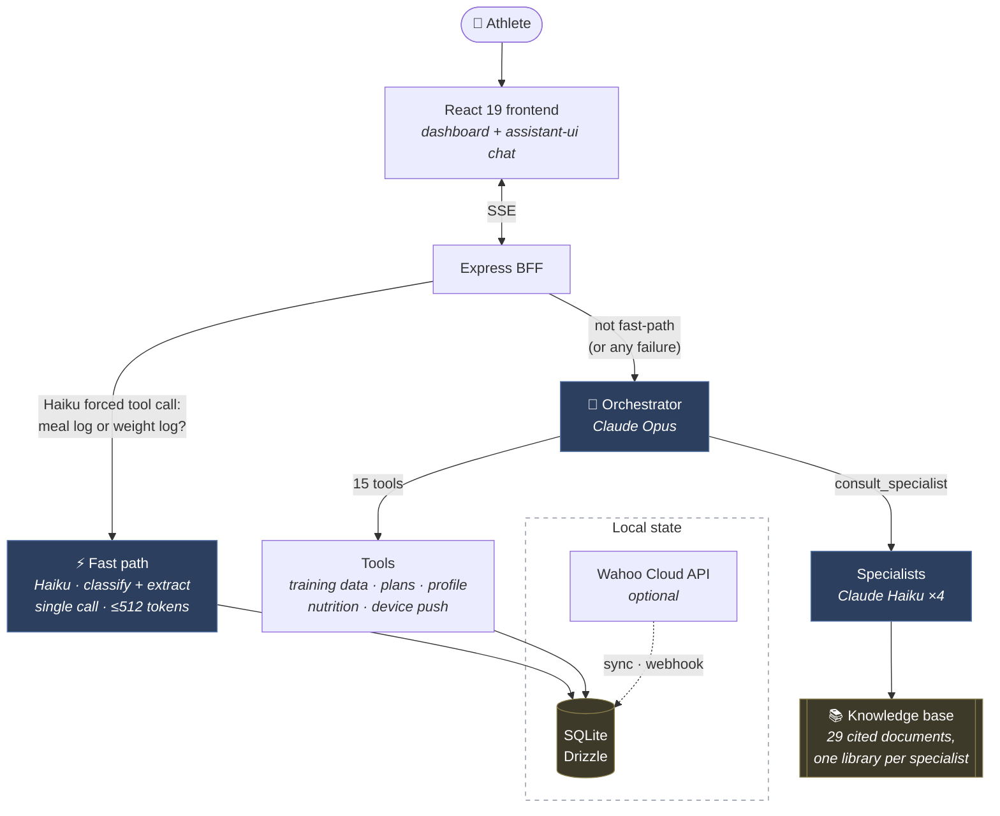
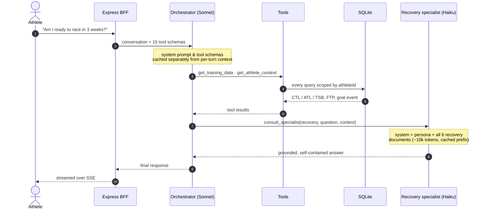

# Rumble

**A personal AI cycling coach grounded in your actual data.** Connects to your training history, fitness metrics, and nutrition logs — then answers coaching questions with real context instead of generic advice.

Built on Claude with a multi-specialist orchestration architecture. Runs entirely on your own machine — bring your own [Anthropic API key](https://console.anthropic.com). No server, no account, no hosted service, no vector database.

## Why I built this

I'm a cyclist. The data already exists (power, heart rate, nutrition, training load) but nothing reasons across all of it at once. Talking to Claude about training is useful only if you paste in the numbers yourself. Memory features help with continuity, but they summarize into prose. They don't preserve that your FTP is 285w, that your TSB is -22, or that you've done four Zone 2 rides in a row. Precision gets lost exactly where it matters most.

The obvious fix is tools: give Claude access to your training data and let it query what it needs. That works, but it hits a ceiling fast. A single model with four coaching domains stuffed into one prompt sounds like a committee and grounds itself in whatever's nearest in context. Token cost compounds as conversation history grows. And general-purpose tool use has no opinion on which questions warrant real domain expertise versus a quick lookup.

Rumble's answer is a two-layer architecture: one orchestrator that owns the conversation and routes decisions, and four isolated domain specialists (cycling, nutrition, recovery, strength) each with their own narrow system prompt and their own cited knowledge base. Specialists are consulted only when their domain is actually needed, on a model that costs a fifth as much. The token budget is managed explicitly: static inputs are prompt-cached, conversation history is trimmed and stubbed rather than replayed in full, and tool results are projected to exclude anything the model doesn't need.

The result is a coach that answers "Am I ready to race in three weeks?" with your actual TSB trend and training history, not a generic periodization lecture.

---

## Demo

|                                    |                                    |                                    |
| :--------------------------------: | :--------------------------------: | :--------------------------------: |
|         |         |         |

---

## Why this is interesting

The chat UI isn't the hard part. The orchestration is.

A single prompt stuffed with four coaching personas and every reference document produces a model that sounds like a committee and grounds itself in whatever happens to be nearest in context. Rumble splits the job in two:

- **One orchestrator** (`claude-opus-4-8`) owns the conversation and the athlete's data. It decides what a question actually needs — a database lookup, a plan revision, real domain expertise, or just an answer.
- **Four specialists** (`claude-haiku-4-5`), each consulted in isolation. A specialist's context contains *only* its own persona and its own document library. It never sees the other three, and never sees the conversation.

That buys two things. Each specialist's voice and grounding stay intact as the knowledge base grows, and expensive reasoning goes only where judgment is actually required — tool routing — while narrow, grounded Q&A runs on a model that costs a fifth as much and answers faster.

**The fast path** exists because meal logging — "had oats and banana before the ride" — is pure structured extraction (text → macros), not coaching judgment. The BFF makes one cheap Haiku call with a forced tool call (`toolChoice: { type: 'tool', name: 'classify_meal_log' }`), which simultaneously classifies the message and extracts the nutrition fields in a single response capped at 512 tokens. If `is_meal_log` is true and the Zod parse succeeds, the meal is written directly and a confirmation is streamed back — skipping the Opus orchestrator entirely. Any failure at any step falls through silently to the full orchestrator path; the user experience is never degraded. Two fast paths exist today: **meal logging** ("had oats and banana") and **weight logging** ("I weigh 74 kg"). Both follow the same pattern. Any failure at any step of either fast path falls through silently to the full orchestrator.



### What a real question looks like



---

## Three decisions worth defending

### 1. No vector database

The obvious design is RAG: chunk the documents, embed them, retrieve the top-k per question. Rumble did exactly that, and then deleted it.

The measurement that killed it: **the largest specialist library is ~14,000 tokens — about 7% of Haiku's context window.** Sending the whole thing in a prompt-cached prefix costs roughly $0.0014 per consult on a cache hit, which is about what four retrieved chunks cost uncached. Retrieval was buying nothing, and charging for it:

| | Retrieval (before) | Whole library (now) |
| --- | --- | --- |
| Can miss relevant content | Yes — no relevance floor, fixed `k` | No |
| Moving parts | Embedder, vector search, `kb_chunks` table, re-embed step | Read files at startup |
| Cost per consult | ~$0.0015 | ~$0.0014 cached · ~$0.014 cold |
| Editing a document | Edit → re-run the embed pipeline | Edit → restart |

Deleting it removed two modules, a build step, a database table, and a 48-package dependency. The knowledge base is still split per specialist — that isolation is the point — but within a specialist there's nothing to tune, miss, or keep in sync.

**This stops being true at roughly 3× the current size.** At 40k+ tokens per vertical, cold-cache cost and prefill latency start to matter, and the right answer becomes letting the specialist request sections from a table of contents — not reintroducing embeddings.

### 2. Prompt caching

The orchestrator's system prompt and all 15 tool schemas are static, so they're marked cache-eligible and sit ahead of the per-turn context. Specialists do the same with persona + library.

Caching is a **prefix match**: one changed byte invalidates everything after it. The fix is ordering — freeze the prefix, and put anything that varies after the last cache breakpoint.

The specialist prefixes are sorted deterministically for the same reason — `readdir` order isn't guaranteed, and a library that concatenates differently between restarts would never cache.

### 3. The auth seam

There's no real auth (single local athlete, no accounts), but every route resolves its athlete through one function — `resolveAthleteId` in `apps/bff/src/middleware/auth.ts`. Adding real auth means rewriting that one function body to verify a session or JWT instead of falling back to the seeded athlete. No controller changes.

Every database query across every tool and controller is scoped by `athleteId`. That was audited by hand, and the audit found two real cross-tenant bugs — both now have regression coverage in `chat.controller.test.ts` and `log-session-feedback.test.ts`, using a harness that simulates two athletes without needing multi-user auth to exist yet.

---

## Token budget

Every API call to Claude carries three categories of tokens: **cached** (paid once per cache TTL), **uncached static** (the same every call, but not cached), and **uncached dynamic** (varies per turn). Understanding which category each input falls into is what keeps cost predictable at scale.

### What's cached

| Input | Cache strategy | ~Tokens |
| --- | --- | --- |
| Orchestrator system prompt (`prompts/orchestrator.md`) | Ephemeral prefix — first block sent to Claude, byte-identical every call | ~503 |
| All 15 tool schemas | Ephemeral on last tool in array — caches the whole block | ~3,200 |
| Specialist persona + full KB | Ephemeral prefix — memoised at startup, sorted deterministically | ~9k–14k |

Caching is a **prefix match** — one changed byte invalidates everything after it. The ordering rule: freeze the static prefix, put anything that varies after the last cache breakpoint. This is why the slim preamble (which has a live timestamp) is a separate block placed *after* the cached system prompt.

Specialist KBs are sent in full rather than retrieved via RAG. The largest library is ~14k tokens — 7% of Haiku's context window. At that size, whole-library cached prefills cost roughly the same as four retrieved chunks uncached, with no relevance floor, no embedding pipeline, and no sync step. See "No vector database" above for the measurement that justified this.

### What the compressor does

Conversation history is the only unbounded input. `message-compressor.ts` trims it when *either* the token estimate exceeds 120k *or* the turn count exceeds 10 recent pairs — whichever comes first. The trim point lands on a real user turn boundary (never mid-tool-round, which would orphan a `tool_result` and cause an API rejection).

Beyond trimming, old `tool_use`/`tool_result` pairs that fall outside the recency window have their payloads stubbed to `[tool result omitted]`. A tool result from turn 3 is still structurally present (so Claude knows a tool was called) but costs ~5 tokens instead of ~2,000.

### Tool result discipline

Tool results are capped at 8,000 characters in `chat.stream.ts` before being sent to Claude. Within that cap, results follow these rules to avoid waste:

- **No implementation fields.** `fitFileUrl`, `externalId`, `source`, `athleteId`, `createdAt` are never included in tool results — they're database internals with no meaning to the model.
- **No redundant representations.** Duration is `durationS` (raw seconds), not `durationS` + `durationFormatted`. Distance is `distanceKm`, not `distanceKm` + `distanceM`.
- **Static notes belong in tool descriptions, not results.** Tool descriptions are part of the cached tool block. A note that appears in a tool *result* is paid on every uncached call; the same note in the tool *description* is paid once per cache TTL.

### .fit file analysis token footprint

The raw per-second streams (3,600–18,000+ numbers for a 1–5 hr ride) are never sent to Claude. `analyze-activity.ts` runs all computation in Node.js — NP, IF, zones, drift, power/HR by thirds — and returns ~250–350 tokens of pre-computed scalars. The optional downsampled trend arrays are capped at 120 points per channel and only auto-included for single-lap activities.

---

## The knowledge base

29 markdown documents across four verticals, each grounded in named, checkable sources — consensus statements, position stands, and meta-analyses rather than coaching blogs.

| Specialist | Docs | Prefix | Representative sources |
| --- | :-: | :-: | --- |
| **Cycling coach** | 9 | ~14.0k tok | Coggan power zones · Seiler polarized training · Poole critical power · Buchheit & Laursen HIIT · Bosquet tapering meta-analysis |
| **Nutritionist** | 8 | ~12.1k tok | Burke & Jeukendrup carbohydrate guidelines · ISSN position stands · IOC 2023 REDs consensus |
| **Recovery** | 6 | ~10.0k tok | ECSS/ACSM overtraining consensus · Walsh 2021 sleep consensus · Dupuy recovery-modality meta-analysis |
| **Strength & conditioning** | 6 | ~9.1k tok | Rønnestad & Mujika · Wilson concurrent-training meta-analysis · Olmedillas cycling bone health |

Each document ends with a `## Sources` block containing full citations. Adding one is: drop a `.md` file in the right folder, restart.

---

## Stack

- **SQLite** via Drizzle — the whole app's state is one file. No database server, no Docker.
- **Claude API** — direct, bring-your-own-key, no proxy or platform in between.
- **React 19 + Vite + Tailwind v4**, chat built on [assistant-ui](https://www.assistant-ui.com/) with a custom adapter over the backend's own SSE protocol.
- **Wahoo Cloud API** for real training data — optional; runs chat-only without it.

## Setup

```bash
cp .env.example .env    # add your ANTHROPIC_API_KEY
pnpm install
pnpm db:migrate
pnpm db:seed            # creates one blank athlete profile
pnpm dev
```

Then just talk to the coach — it asks for your FTP, weight, and goals on the first message rather than making you fill in a config screen.

## Project structure

```
apps/bff/                 Express backend — chat orchestration, tools, Wahoo sync, SQLite
apps/web/                 React frontend
rumble-knowledge-base/    Markdown docs, one folder per specialist — edit and restart, no build step
```

**Conventions.**

- `<subject>.<role>.ts` — module entry points (`controller`, `client`, `service`, `executor`, `normalizer`, `stream`, `sync`)
- `kebab-case.ts` — leaf utilities, pure helpers, and per-tool handlers under `modules/tools/`
- Every database query is scoped by `athleteId` — no exceptions

## Development

```bash
pnpm typecheck   # both apps
pnpm lint        # both apps (ESLint flat config, shared root config)
pnpm test        # Vitest — pure logic, BFF integration tests, web components
```

Tests run against a fresh in-memory SQLite database, migrated from `apps/bff/drizzle` and never the real `data/rumble.db` — see `apps/bff/src/test-utils/test-db.ts`.

## Known gaps

Being honest about the edges, because a portfolio piece that claims to be finished isn't believable:

- **Per-athlete document upload** (training plans, lab results via Claude's Files API) is designed but not built.
- **Test coverage is deliberately scoped** to pure logic and the highest-risk backend paths — auth and data scoping, the multi-round tool loop. React components and the Wahoo sync flow aren't covered.
- **The compiled path gets less exercise than `pnpm dev`.** `pnpm build` now copies the prompt `.md` files into `dist/` (`tsc` alone doesn't), and the built module has been verified to load its prompts and resolve the knowledge base — but day-to-day development runs from source via `tsx`, so the compiled path isn't covered by CI.
