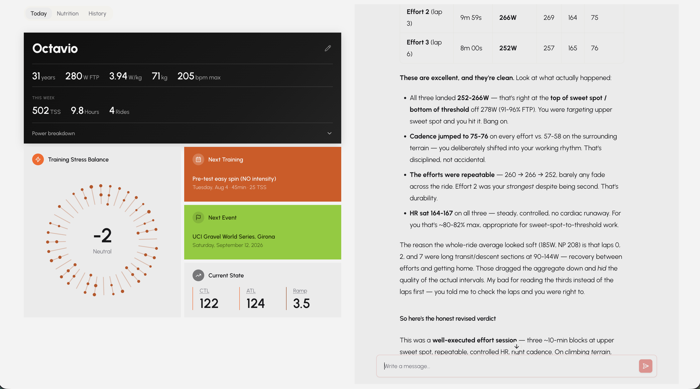
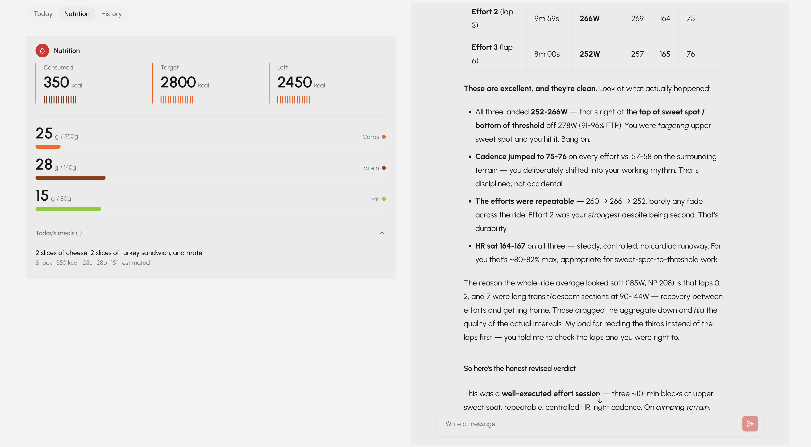
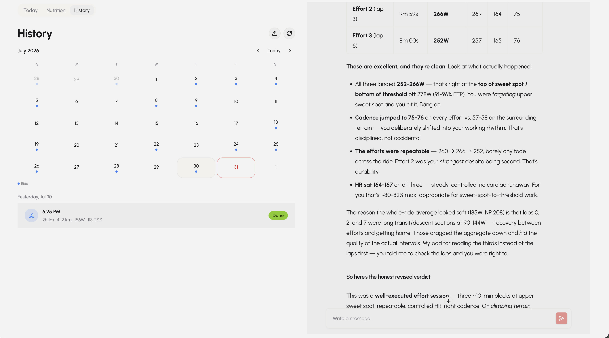
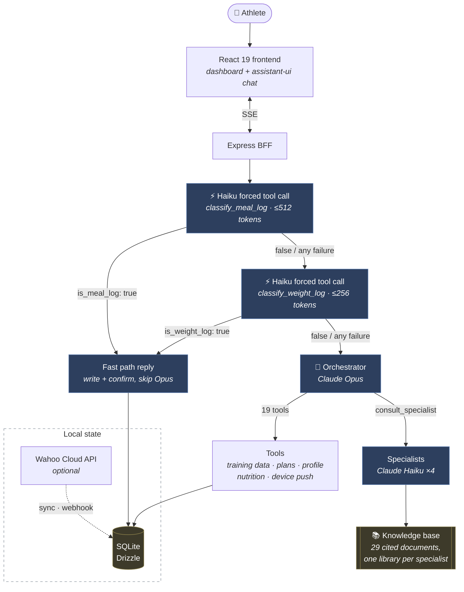

# Rumble

**A personal AI cycling coach grounded in your actual data.** Connects to your training history, fitness metrics, and nutrition logs — then answers coaching questions with real context instead of generic advice.

## Why I built this

I'm a cyclist. We measure everything — power, heart rate, sleep, weight, nutrition, training load, coaching history. The data exists. It just doesn't reason across all of it at once.

**What a generalist LLM already does well:**
- Explains training concepts clearly
- Reasons well over whatever numbers you paste into the chat
- Holds a conversation, with some memory of what was said before

**What it doesn't:**
- Query your actual data — you're transcribing numbers by hand, every time
- Preserve precision across a season — memory features summarize into prose, and prose drops exact numbers
- Know when a question needs real domain expertise (sports-nutrition literature, overtraining research) instead of a quick lookup
- Stay grounded once several coaching domains are stacked into one prompt — cycling, nutrition, recovery, and strength advice from a single voice reads like a committee, not a coach

**What Rumble does instead:**
- Gives the model tools to query training history, fitness metrics, and nutrition logs directly — nothing transcribed by hand
- Splits domain judgment into isolated specialists (cycling, nutrition, recovery, strength), each grounded in its own cited knowledge base, consulted only when the question actually needs it
- Writes durable notes as facts come up in conversation, so a new chat thread still remembers an injury, a pacing plan, a diet change — no lossy summarization pass
- Manages token cost explicitly, so a growing history and specialist consults don't make the coach slower or pricier over time

The result: a coach that answers with your actual numbers and history, not a generic periodization lecture.

**Who this is for:** a cyclist training against a real goal event who wants answers grounded in their own numbers and in checkable sports-science — not what you already have:

- **Not plain Claude/ChatGPT.** A general chat has no access to your training data — you're pasting your numbers in by hand, every time, and it forgets them by the next conversation. Ask it about tapering and it'll sound just as confident whether it's right or not; there's no source behind the answer.
- **Not TrainingPeaks/WKO5.** Those chart your data; they don't reason over it. No chart answers "should I ride tired today," and neither cites a source for the training advice underneath its numbers.
- **Not a coach's monthly fee.** A real coach isn't available at 11pm when you're deciding whether to skip tomorrow's intervals, and costs real money either way. Rumble is bring-your-own Anthropic API key — you pay for the tokens an actual conversation uses, not a subscription, and the architecture (see "Token budget" below) is built specifically to keep that number small.

Running it needs an Anthropic API key and either a Wahoo connection or logging rides by hand — no ML background required, and it runs chat-only without Wahoo at all.

---

## Demo

|                                    |                                    |                                    |
| :--------------------------------: | :--------------------------------: | :--------------------------------: |
|    |  |  |
| **Today** — FTP, weekly load, training stress balance, next session | **Nutrition** — macros logged via the fast path against daily target | **History** — ride calendar, plan vs. what actually happened |

Coach chat runs alongside every tab (right pane above) — one conversation, not a separate screen.

---

## How it works

The chat UI isn't the hard part. The orchestration is.

Stuffing four coaching personas and every reference document into one prompt is the failure mode described above. Rumble splits that single prompt into two layers instead of trying to prompt-engineer around it:

- **One orchestrator** (`claude-opus-4-8`) owns the conversation and the athlete's data. It decides what a question actually needs — a database lookup, a plan revision, real domain expertise, or just an answer.
- **Four specialists** (`claude-haiku-4-5`), each consulted in isolation. A specialist's context contains *only* its own persona and its own document library. It never sees the other three, and never sees the conversation.

That buys two things. Each specialist's voice and grounding stay intact as the knowledge base grows, and expensive reasoning goes only where judgment is actually required — tool routing — while narrow, grounded Q&A runs on a model that costs a fifth as much and answers faster.

**The fast path** exists because meal logging — "had oats and banana before the ride" — is pure structured extraction (text → macros), not coaching judgment. The BFF makes one cheap Haiku call with a forced tool call (`toolChoice: { type: 'tool', name: 'classify_meal_log' }`), which simultaneously classifies the message and extracts the nutrition fields in a single response capped at 512 tokens. If `is_meal_log` is true and the Zod parse succeeds, the meal is written directly and a confirmation is streamed back — skipping the Opus orchestrator entirely. Any failure at any step falls through silently to the full orchestrator path; the user experience is never degraded. Two fast paths exist today: **meal logging** ("had oats and banana") and **weight logging** ("I weigh 74 kg"). Both follow the same pattern. Any failure at any step of either fast path falls through silently to the full orchestrator.



### What a real question looks like


---

## Design decisions

### 1. No vector database

The obvious design is RAG: chunk the documents, embed them, retrieve the top-k per question. Rumble did exactly that, and then deleted it.

The measurement that killed it: **the largest specialist library is ~14,000 tokens — about 7% of Haiku's context window.** Sending the whole thing in a prompt-cached prefix costs roughly $0.0014 per consult on a cache hit, which is about what four retrieved chunks cost uncached. Retrieval was buying nothing, and charging for it:

| | Retrieval (before) | Whole library (now) |
| --- | --- | --- |
| Can miss relevant content | Yes — no relevance floor, fixed `k` | No |
| Moving parts | Embedder, vector search, dedicated chunk table, re-embed step | Read files at startup |
| Cost per consult | ~$0.0015 | ~$0.0014 cached · ~$0.014 cold |
| Editing a document | Edit → re-run the embed pipeline | Edit → restart |

Deleting it removed two modules, a build step, a database table, and a 48-package dependency. The knowledge base is still split per specialist — that isolation is the point — but within a specialist there's nothing to tune, miss, or keep in sync.

**This stops being true at roughly 3× the current size.** At 40k+ tokens per vertical, cold-cache cost and prefill latency start to matter, and the right answer becomes letting the specialist request sections from a table of contents — not reintroducing embeddings.

### 2. Prompt caching

The orchestrator's system prompt and all 19 tool schemas are static, so they're marked cache-eligible and sit ahead of the per-turn context. Specialists do the same with persona + library.

Caching is a **prefix match**: one changed byte invalidates everything after it. The fix is ordering — freeze the prefix, and put anything that varies after the last cache breakpoint.

The specialist prefixes are sorted deterministically for the same reason — `readdir` order isn't guaranteed, and a library that concatenates differently between restarts would never cache.

### 3. The auth seam

There's no real auth (single local athlete, no accounts), but every route resolves its athlete through one function — `resolveAthleteId` in `apps/bff/src/middleware/auth.ts`. Adding real auth means rewriting that one function body to verify a session or JWT instead of falling back to the seeded athlete. No controller changes.

Every database query across every tool and controller is scoped by `athleteId`. That was audited by hand, and the audit found two real cross-tenant bugs — both now have regression coverage in `chat.controller.test.ts` and `log-session-feedback.test.ts`, using a harness that simulates two athletes without needing multi-user auth to exist yet.

### 4. Durable memory across chats, not RAG or auto-summarization

A brand new chat thread has no message history of its own, but the coaching relationship has to survive that — FTP changes, an injury constraint, a pacing plan agreed on last week. The obvious answers are an LLM summarizer over old transcripts, or embedding old messages for retrieval. Rumble does neither, for the same reason it skipped RAG for the knowledge base: there's a simpler mechanism that's already sitting there.

The model writes structured coaching notes (`save_coaching_note`) as facts come up in conversation — categorized (`health`, `constraint`, `preference`, `decision`, `nutrition`, `schedule`, `observation`, `general`), no separate summarization pass needed since the note is a byproduct of the same tool call. Every turn's preamble includes the safety/identity-critical categories in full — the ones that should shape a response regardless of what the conversation is about — and archives the rest behind a per-category count plus `get_coaching_notes({ category })`, so per-turn cost stays roughly flat instead of growing with a season's worth of decisions and observations. When a note revises rather than extends a prior one (a corrected pacing plan superseding the one it replaces), `supersedes_note_id` retires the old note instead of both accumulating in the archive indefinitely.

The user's own message is persisted the instant the request is received, too — not batched with the (possibly multi-round, multi-tool-call) reply. A page refresh mid-generation shows what was actually sent instead of reverting to the chat's state before that turn.

### 5. Typed context per specialist, not a free-form blob

`consult_specialist`'s `athlete_context` used to be `{ type: 'object' }` — the orchestrator decided what to put in it, with nothing structural stopping it from forgetting a field the specialist actually needed (a nutrition question dispatched without the athlete's weight, say).

The fix isn't validation bolted on top of the blob — that just moves the same failure to a generic error later. It's inverting who declares what's needed: each specialist owns a small zod contract (`SPECIALIST_CONTEXT_CONTRACTS` in `model-config.ts`) naming its own required and optional fields. `consult_specialist` validates `athlete_context` against the chosen specialist's contract *before* the Haiku call — a missing required field fails with the field named, at zero API cost, and the orchestrator can self-correct next round the same way it already does for a malformed tool argument elsewhere in the app.

The same contract generates the tool's own description (`describeSpecialistContracts()`), so the orchestrator sees what each specialist needs before it's rejected for skipping it, not just after.

### 6. Arbitration when specialists disagree, not silent synthesis

The orchestrator can consult more than one specialist in a round — a training-and-nutrition question, say — and nothing stopped it from just picking one specialist's view in its own synthesis, silently, with no record of what it discarded or why.

The fix doesn't ask specialists to negotiate with each other — that's a fake protocol dressed as a real one. It makes the orchestrator's synthesis step explicit instead of emergent: when two or more specialists are consulted in the *same* round (the shape of "couldn't decide which was authoritative," not two independent reads consulted turns apart as sequential inputs to a plan), a cheap forced-tool Haiku call (`arbitrate-specialists.ts`) checks their answers for a genuine contradiction — not different emphasis, a real conflict. Detecting a contradiction and phrasing why it matters both need judgment, so that's the model's job. Which domain wins does not: `higherPrioritySpecialist()` is a two-line, hard-coded lookup (`recovery > cycling_coach > {nutritionist, strength_conditioning}`), never trusted from the model's own output — the guarantee that arbitration is *deterministic* is literal, not just described.

Nutritionist and strength_conditioning are equal priority — a real tie, not a rounding error in the tier numbers. The first recorded eval fixture caught what that meant in practice: `higherPrioritySpecialist()` originally defaulted a tie to whichever domain the classifier named first, and the classifier's own `reason` text argued for the *other* domain — a fake winner with an incongruent justification. It now returns `null` on a genuine tie: no contradiction-notice card is shown (there's no winner to put on it), and the orchestrator is told to weigh the tradeoff itself, with the full conversation context arbitration never sees.

The resolution rides into the orchestrator's next round as an extra context block, not a fake `tool_result` (Claude requires every one of those to match a real `tool_use` id from that round), and `orchestrator.md` tells the model to defer to a flagged contradiction and cite it rather than re-litigate the specialists itself. The athlete sees a short, separate notice — which domains disagreed and which one the app went with — never the full priority reasoning. Fails open at every step: a contradiction the classifier can't parse, or an API error, just means the orchestrator synthesizes exactly as it always did.

---

## Token budget

Every API call to Claude carries three categories of tokens: **cached** (paid once per cache TTL), **uncached static** (the same every call, but not cached), and **uncached dynamic** (varies per turn). Understanding which category each input falls into is what keeps cost predictable at scale.

### What's cached

| Input | Cache strategy | ~Tokens |
| --- | --- | --- |
| Orchestrator system prompt (`prompts/orchestrator.md`) | Ephemeral prefix — first block sent to Claude, byte-identical every call | ~503 |
| All 19 tool schemas | Ephemeral on last tool in array — caches the whole block | ~3,200 |
| Specialist persona + full KB | Ephemeral prefix — memoised at startup, sorted deterministically | ~9k–14k |

Caching is a prefix match (see "Prompt caching" above for why). In practice: the slim preamble, which carries a live timestamp, is a separate block placed *after* the cached system prompt — so it never invalidates the cache ahead of it.

Specialist KBs are sent in full rather than retrieved via RAG. The largest library is ~14k tokens — 7% of Haiku's context window. At that size, whole-library cached prefills cost roughly the same as four retrieved chunks uncached, with no relevance floor, no embedding pipeline, and no sync step. See "No vector database" above for the measurement that justified this.

### What the compressor does

Conversation history is the only unbounded input. `message-compressor.ts` trims it when *either* the token estimate exceeds 120k *or* the turn count exceeds 10 recent pairs — whichever comes first. The trim point lands on a real user turn boundary (never mid-tool-round, which would orphan a `tool_result` and cause an API rejection).

Beyond trimming, old `tool_use`/`tool_result` pairs that fall outside the recency window have their payloads stubbed to `[tool result omitted]`. A tool result from turn 3 is still structurally present (so Claude knows a tool was called) but costs ~5 tokens instead of ~2,000.

Coaching notes are the other input that grows with the athlete's history rather than the conversation — see "Durable memory across chats" above for how those stay bounded per turn.

### Tool result discipline

Tool results are capped at 8,000 characters in `chat.stream.ts` before being sent to Claude. Within that cap, results follow these rules to avoid waste:

- **No implementation fields.** `fitFileUrl`, `externalId`, `source`, `athleteId`, `createdAt` are never included in tool results — they're database internals with no meaning to the model.
- **No redundant representations.** Duration is `durationS` (raw seconds), not `durationS` + `durationFormatted`. Distance is `distanceKm`, not `distanceKm` + `distanceM`.
- **Static notes belong in tool descriptions, not results.** Tool descriptions are part of the cached tool block. A note that appears in a tool *result* is paid on every uncached call; the same note in the tool *description* is paid once per cache TTL.

### .fit file analysis token footprint

The raw per-second streams (3,600–18,000+ numbers for a 1–5 hr ride) are never sent to Claude. `analyze-activity.ts` runs all computation in Node.js — NP, IF, zones, drift, power/HR by thirds — and returns ~250–350 tokens of pre-computed scalars. The optional downsampled trend arrays are capped at 120 points per channel and only auto-included for single-lap activities.

---

## The knowledge base

29 markdown documents across four verticals, each grounded in named, checkable sources — consensus statements, position stands, and meta-analyses rather than coaching blogs. Full citations live in each document's own `## Sources` block; browse them in [`rumble-knowledge-base/`](rumble-knowledge-base/), one folder per specialist.

| Specialist | Docs | Prefix |
| --- | :-: | :-: |
| **Cycling coach** | 9 | ~14.0k tok |
| **Nutritionist** | 8 | ~12.1k tok |
| **Recovery** | 6 | ~10.0k tok |
| **Strength & conditioning** | 6 | ~9.1k tok |

Adding a document is: drop a `.md` file in the right folder, restart.

---

## Evaluating tool selection

Non-deterministic output makes the orchestrator's tool choices hard to regression-test the normal way — the same prompt can produce two reasonable-but-different answers. What's checkable is the *trace*: which tools got called, in what order, with what arguments. The response text is noise for this; the tool trace is the signal.

A golden-trace fixture (`apps/bff/src/eval/fixtures/`) names the expected tool sequence for a prompt; a scorer (`score-trace.ts`) checks it as an ordered subsequence — extra, unlisted calls don't fail a fixture, but the calls it does list must happen in that relative order, with matching arguments. `record-tape.ts` runs the real orchestrator against the live API once and freezes the result to a cassette (`apps/bff/src/eval/cassettes/`, never against `data/rumble.db` directly — it records against a copy, so a run can't write into anyone's real coaching history to produce a test fixture). `eval-*.test.ts` then replays that cassette deterministically — no API cost, no live-model dependency — through the real orchestration loop, so CI also catches a regression in the *harness* (round budget, message assembly) and not only in the recorded trace.

What this can't do: catch the model getting worse, or an `orchestrator.md` edit changing behavior — the response is frozen at record time. That's why re-taping is a manual step (rerun `record-tape.ts` against the live API), not something CI does automatically.

Three fixtures exist today — a proof of shape, not a suite — and each caught something real rather than just confirming a guess:

- **`race-readiness`** — the first hand-guessed golden trace assumed the orchestrator would pull raw training data and consult the recovery specialist. The recorded run did neither: it answered well from `get_athlete_context` alone, which already carries CTL/ATL/TSB and the athlete's own saved coaching notes.
- **`creatine-timing-arbitration`** — built to exercise arbitration end-to-end (two specialists consulted in one round, a real contradiction, the tie-break path). It did: the first live recording caught the tie-break bug described above, before it shipped.
- **`nutrition-missing-weight`** — set out to catch `consult_specialist`'s validation-error retry loop live. It never fired, across five recordings: the orchestrator consistently checks for missing context and asks the athlete directly rather than attempting a consult it can already tell would fail, from the same tool description that would have produced the error. A different, and arguably better, finding than the one hypothesized.

Each fixture's `_provenance` field in `fixtures/*.json` has the full story of what was guessed versus what was actually recorded.

---

## Stack

- **SQLite** via Drizzle — the whole app's state is one file. No database server, no Docker.
- **Claude API** — direct, bring-your-own-key, no proxy or platform in between.
- **React 19 + Vite + Tailwind v4**, chat built on [assistant-ui](https://www.assistant-ui.com/) with a custom adapter over the backend's own SSE protocol.
- **Wahoo Cloud API** for real training data — optional; runs chat-only without it.

## Setup

```bash
cp .env.example .env    # add your ANTHROPIC_API_KEY
pnpm install
pnpm db:migrate
pnpm db:seed            # creates one blank athlete profile
pnpm dev
```

Then just talk to the coach — it asks for your FTP, weight, and goals on the first message rather than making you fill in a config screen.

## Project structure

```
apps/bff/                 Express backend — chat orchestration, tools, Wahoo sync, SQLite
apps/web/                 React frontend
rumble-knowledge-base/    Markdown docs, one folder per specialist — edit and restart, no build step
```

**Conventions.**

- `<subject>.<role>.ts` — module entry points (`controller`, `client`, `service`, `executor`, `normalizer`, `stream`, `sync`)
- `kebab-case.ts` — leaf utilities, pure helpers, and per-tool handlers under `modules/tools/`
- Every database query is scoped by `athleteId` — no exceptions

## Development

```bash
pnpm typecheck   # both apps
pnpm lint        # both apps (ESLint flat config, shared root config)
pnpm test        # Vitest — pure logic, BFF integration tests, web components
```

Tests run against a fresh in-memory SQLite database, migrated from `apps/bff/drizzle` and never the real `data/rumble.db` — see `apps/bff/src/test-utils/test-db.ts`.

## Known gaps

In daily use, not fully built — here's what's still open:

- **Per-athlete document upload** (training plans, lab results via Claude's Files API) is designed but not built.
- **Test coverage is deliberately scoped** to pure logic and the highest-risk backend paths — auth and data scoping, the multi-round tool loop. React components and the Wahoo sync flow aren't covered.
- **The compiled path gets less exercise than `pnpm dev`.** `pnpm build` now copies the prompt `.md` files into `dist/` (`tsc` alone doesn't), and the built module has been verified to load its prompts and resolve the knowledge base — but day-to-day development runs from source via `tsx`, so the compiled path isn't covered by CI.
- **`getDefaultAthleteId()` has no ordering guarantee.** It's `SELECT ... LIMIT 1` with no `ORDER BY`, on the assumption that exactly one `athletes` row exists — true until something violates it (e.g. a seed script run against the wrong `DATABASE_PATH`, which silently targets a second SQLite file instead of erroring). If a second row ever appears, which one "the athlete" resolves to is undefined, and chats/notes tied to the other row become invisible rather than merged. Fine for a single-tenant local app; the fix is either an explicit invariant check at startup or making this the first thing real auth replaces.
- **A stale `chatId` retries instead of recovering.** The web client caches the active chat's id in `localStorage`; if the server 404s it (chat deleted, or owned by a different athlete row per the point above), `chat-runtime.ts` throws but never clears the cached id — every subsequent message retries the same dead id and 404s again. Should clear the id and start a fresh chat on a 404 instead.
- **A contradiction-notice doesn't survive a page reload.** It's carried as a plain text block inside the persisted `tool_result` message — not a shape `loadInitialMessages`'s reconstruction logic knows to look for (it only replays `consult_specialist` results into messages). Live streaming shows it; reopening the chat later doesn't. Same category of gap as the point above — a real follow-up, not a hidden one.
